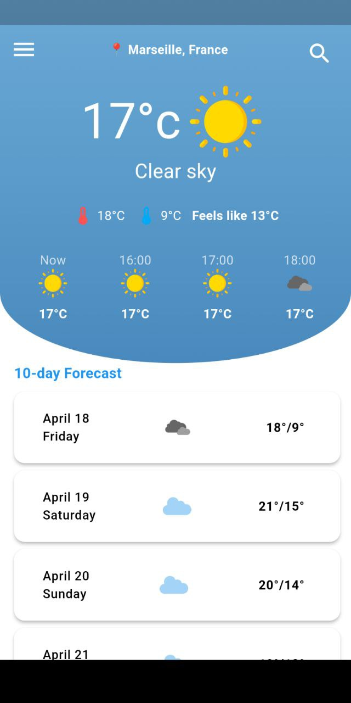
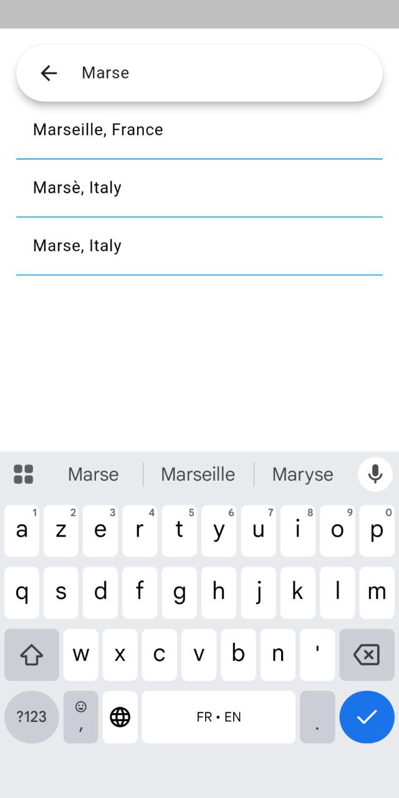
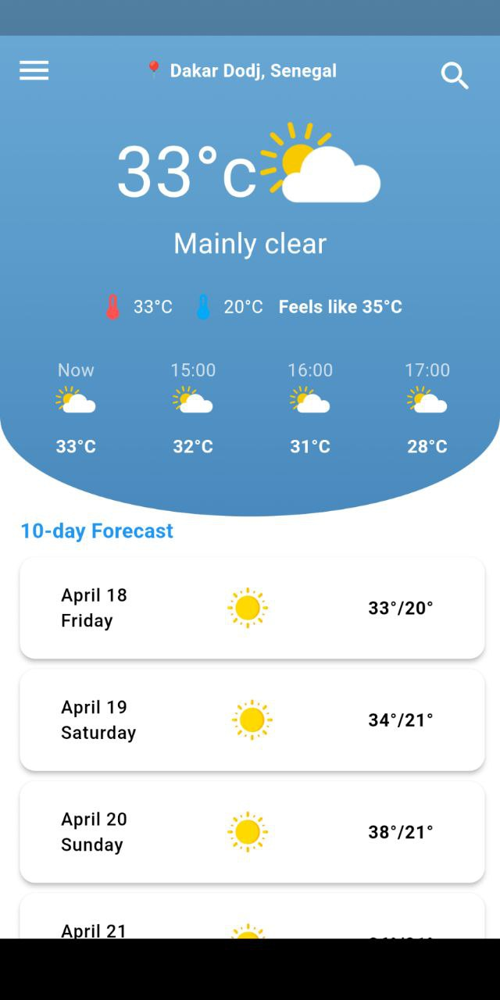

# 🌤️ Meteo App (Flutter)

A simple  **mini weather app** built using **Flutter** and **GetX**. It displays the current weather, hourly forecasts, and a 10-day forecast based on your current location or any place you search for.

---

## 🚀 Features

- 📍 Auto-detects your current location
- 🔍 Search for any city (with live suggestions)
- 🌡️ Displays current temperature and weather condition
- ⏳ 36-hour hourly weather forecast
- 📅 10-day daily weather forecast
- 🧭 Timezone-aware forecast parsing
- ⚙️ Built using GetX for state management and routing
- 🌐 Uses the free and open **Open-Meteo API**

---

## 📸 Screenshots

  &nbsp;&nbsp;&nbsp;
  &nbsp;
  

---

## 🧠 Architecture & Folder Structure

The app uses **GetX** to organize logic, UI, and services into separate layers.

| Folder              | Role Description                                      |
|---------------------|-------------------------------------------------------|
| `controller/`       | Application logic, state handling with GetX           |
| `models/`           | Data models (weather, location, forecasts)            |
| `repository/`       | Business logic and data abstraction                   |
| `services/`         | API clients (weather and geolocation services)        |
| `views/`            | Screens and pages of the app                          |
| `widgets/`          | Reusable UI components                                |
| `assets/images/`    | Local weather icons used in the UI                    |

---

## 🧰 Tech Stack

- 🧩 **Flutter** – Cross-platform UI toolkit
- ⚙️ **GetX** – State management and navigation
- ☁️ **Open-Meteo API** – Weather and geolocation data
- 🌍 **Geolocator** – Device location access
- 🗺️ **Geocoding** – Reverse lookup of coordinates
- 🕒 **flutter_native_timezone** – Device timezone support
- 📡 **HTTP** – For calling REST APIs

---

## 🔧 Getting Started

### 📦 Prerequisites

- Flutter SDK (>= 3.10)
- Dart SDK
- Android Studio or VS Code
- A real device or emulator

